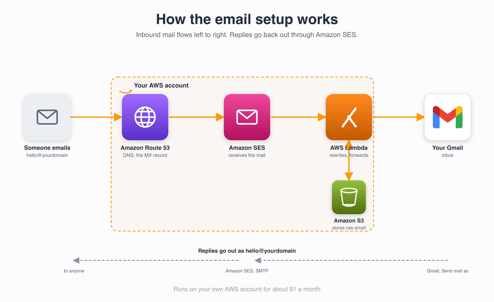

# custom-domain-email

Receive email at your own domains in Gmail, and reply as those domains, for about
a dollar a month. No Google Workspace, no paid forwarding service. It runs on your
own AWS account (SES + Lambda + S3 + Route53) and is managed with Terraform.

Inbound mail to `*@yourdomain` is received by SES, stored in S3, and a Lambda
re-sends it to your Gmail (the original sender is kept in `Reply-To`). Outbound
uses SES SMTP wired into Gmail's "Send mail as".



## What it costs

Around **$1/month** at personal volume, almost all of which is the optional
monitoring (4 CloudWatch alarms + 1 custom metric). Mail receiving, sending,
Lambda, S3, and the dead-letter SQS queue sit inside free tiers. Route53 hosted
zones are billed separately at $0.50/zone whether or not you run this.

## Requirements

- An AWS account.
- Your domains' DNS in **Route53** (in that same account).
- Terraform and the AWS CLI installed and authenticated.

## Setup

```bash
cp config/domains.example.yaml config/domains.yaml   # your domains + where they forward
cp .env.example .env                                 # your alarm email

./deploy.sh             # Phase 1: stand everything up (MX NOT switched yet)
./status.sh             # watch until domains + destinations are verified
./deploy.sh --cutover   # Phase 2: flip inbound MX to SES
```

`config/domains.yaml` and `.env` are gitignored, so your addresses never get
committed.

The rollout is two-phase on purpose: Phase 1 is non-destructive (any existing
inbound keeps working), and you only switch MX once SES has verified everything,
so no mail is lost in the gap. Between the phases:

1. **Verify destinations.** SES emails a link to each `forward_to` address. Click
   it. This is required while the SES account is in the sandbox.
2. **Wait for verification.** `./status.sh` should show every domain and
   destination verified before you cut over.

After cutover:

3. **Test.** Email an address on one of your domains. It should land in Gmail.
4. **Reply as your domain.** In Gmail: Settings > Accounts and Import >
   "Send mail as" > add `hello@yourdomain`, with:
   ```
   SMTP server: email-smtp.<region>.amazonaws.com   (terraform output smtp_endpoint)
   Port:        465 (SSL)
   Username:    terraform output -raw smtp_username
   Password:    terraform output -raw smtp_password
   ```
   One credential set works for every domain. Gmail emails a confirmation code to
   `hello@yourdomain`, which now forwards into your inbox.

5. **Leave the sandbox** (optional, free) to reply to anyone, not just verified
   addresses: request production access in the SES console.

## Show your photo next to outgoing mail (optional, free)

Gmail shows the sender's Google profile photo. A "Send mail as" alias has none, so
give the address its own free Google profile:

1. In a signed-out browser, go to accounts.google.com > Create account >
   "For my personal use".
2. On the username screen, click **"Use your existing email"** and enter
   `hello@yourdomain`.
3. Enter the verification code Google sends (it forwards into your inbox).
4. Set the profile photo. Recipients now see it next to your emails.

## How it works

```
mail -> Route53 MX -> SES receipt rule -> S3 (raw) ┐
                                                    ├─> Lambda -> SES SendRawEmail -> Gmail
                                             invoke ┘
reply <- Gmail "Send mail as" <- SES SMTP <───────────────────────────────────────────────┘
```

- **`main.tf`** loads `config/domains.yaml` and builds the routing map.
- **`shared.tf`** S3 bucket, forwarder Lambda, SES rule set, SMTP user, log groups.
- **`modules/domain/`** per-domain SES identity, DKIM, MX, receipt rule.
- **`monitoring.tf`** SNS alerts, alarms, heartbeat canary.
- **`lambda/src/`** forwarder runtime (`lib.mjs` pure logic, `index.mjs` handler).
- **`lambda/test/`** unit tests. **`canary/`** heartbeat sender.

## Tests

The routing and header-rewrite logic lives in `lambda/src/lib.mjs` and is covered
by `lambda/test/lib.test.mjs` (Node's built-in runner, no dependencies):

```bash
cd lambda && npm test
```

To change behaviour, add or adjust a case, watch it fail, then edit `lib.mjs`
until it passes. The handler stays a thin I/O shell over the tested functions.

## Monitoring

You get an email (SNS to `alert_email`) if anything breaks:

- **forwarder-errors** / **forwarder-throttles** if the Lambda fails.
- **forwarder-dlq** if a forward fails every retry. SES invokes the forwarder
  asynchronously, so any invocation that still throws after its retries is routed
  to an SQS dead-letter queue (`*-forwarder-dlq`) instead of vanishing. The
  message is held there 14 days for inspection or replay, and the raw email is
  still in S3 — so a delivery failure is always caught, never silent.
- **heartbeat-missing** if the end-to-end pipeline goes silent. A canary emails
  `probe@<first-domain>` hourly through the real path; the forwarder records a
  `CanaryHeartbeat` metric on arrival. If none lands inside the window, the alarm
  fires, which catches silent failures a plain error alarm cannot (MX changed,
  receipt rule disabled).

### Oversize mail

SES *receives* up to 40 MB but `SendRawEmail` only *sends* up to 10 MB, so a
message in that gap can't be forwarded whole. Instead of failing (and dropping
it), the forwarder:

1. **Recompresses images to fit.** Most oversize mail is photos. It re-encodes
   the images (largest first, highest quality that still fits) until the message
   is under 10 MB and forwards it as a normal email — inline photos intact, just
   at lower resolution. This handles the common case transparently.
2. **Falls back to an archive notice** when images alone can't get under the
   limit (e.g. a large video). The original is copied to the `archive/` prefix
   (which the lifecycle rule never expires) and you get a small notice with the
   sender, subject, size, and the `aws s3 cp` command to pull the full original.

Either way a large email is never silently dropped. (An earlier design served the
fallback as a one-click Lambda Function URL link, but this AWS account blocks
public function URLs, so the private S3 archive is the durable path instead.)

Confirm the SNS subscription email AWS sends after the first apply, or alarms
cannot reach you.

## Notes

- Setting the SES MX overwrites any existing MX on the domain (the `--cutover`
  step). Existing inbound forwarding is replaced.
- Custom MAIL FROM is off by default, so a domain already sending via SES or
  Resend keeps working untouched.
- Region defaults to `us-east-1` because SES inbound is region-limited
  (us-east-1, us-west-2, eu-west-1).
- Raw emails auto-delete from S3 after 30 days.
